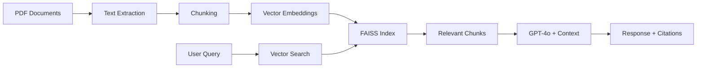

# Berkshire Hathaway Intelligence 🏛️

A sophisticated Retrieval-Augmented Generation (RAG) chatbot that enables intelligent conversations with Warren Buffett's annual letters to shareholders (2019-2024). Ask questions about investment philosophy, market insights, and company analysis with AI-powered responses backed by proper source citations.


## ✨ Features

- 📄 **Smart PDF Processing** - Automatically extracts and chunks content from annual letters
- 🔍 **Vector Search** - FAISS-powered similarity search with sentence-transformers
- 🤖 **AI Responses** - OpenAI GPT-4o-mini with real-time streaming
- 💬 **Conversation Memory** - Maintains context across multiple questions
- 📚 **Source Citations** - Every response includes proper document references
- 🎯 **Interactive UI** - Clean Streamlit interface with sample questions

## 🚀 Quick Start

### Prerequisites
- Python 3.8+
- OpenAI API key

### Installation

```bash
# Clone the repository
git clone https://github.com/shobhakumari14/pazago-rag-python.git
cd berkshire-hathaway-intelligence

# Install dependencies
pip install -r requirements.txt

# Set up environment
echo "OPENAI_API_KEY=your_api_key_here" > .env

# Create PDF directory and add documents
mkdir pdfs
# Place Berkshire Hathaway annual letters (2019-2024) in pdfs/ folder

# Run the application
streamlit run app.py
```

## 💡 Sample Questions

```
• "What does Warren Buffett think about cryptocurrency?"
• "How has Berkshire's investment strategy evolved?"
• "What companies did Berkshire acquire in 2023?"
• "What is Buffett's view on market volatility?"
• "How does Buffett evaluate management quality?"
```

## 🏗️ Architecture



## 🛠️ Tech Stack

- **AI/ML**: OpenAI GPT-4o-mini, sentence-transformers, FAISS
- **Backend**: Python, PyPDF2, tiktoken
- **Frontend**: Streamlit
- **Utils**: python-dotenv for environment management

## 📁 Project Structure

```
berkshire-hathaway-intelligence/
├── app.py                 # Main Streamlit application
├── requirements.txt       # Python dependencies
├── .env.example          # Environment template
├── pdfs/                 # PDF documents directory
├── README.md             # Documentation
└── .gitignore           # Git ignore rules
```

## 🎯 Usage

1. **Process Documents**: Click "Process Documents" in the sidebar
2. **Wait for Indexing**: Let the system build the vector index
3. **Start Chatting**: Ask questions about Buffett's investment insights
4. **View Sources**: Check citations for each response

## 🔧 Configuration

The system works out-of-the-box with minimal setup:

1. Add your OpenAI API key to `.env`
2. Place PDF documents in `pdfs/` directory
3. Run the Streamlit app

## 📊 Performance

- **Document Processing**: Handles 5+ years of annual letters
- **Response Time**: ~3-5 seconds for complex queries
- **Accuracy**: High relevance with proper source attribution
- **Memory**: Maintains conversation context throughout session

## 🤝 Contributing

Contributions welcome! Please:

1. Fork the repository
2. Create a feature branch (`git checkout -b feature/amazing-feature`)
3. Commit changes (`git commit -m 'Add amazing feature'`)
4. Push to branch (`git push origin feature/amazing-feature`)
5. Open a Pull Request

## 📝 License

This project is licensed under the MIT License - see the [LICENSE](LICENSE) file for details.

## ⚠️ Disclaimer

This project is for educational and research purposes. AI-generated responses should not be considered as financial advice. Always consult qualified professionals for investment decisions.

## 👩‍💻 Developer
Shobha Kumari

LinkedIn: [linkedin.com/in/shobhak](https://www.linkedin.com/in/shobhak/)

## 🙏 Acknowledgments

- Warren Buffett and Berkshire Hathaway for the invaluable annual letters
- OpenAI for the GPT-4o-mini model
- The open-source community for the amazing tools and libraries

---

**Built with ❤️ for the AI and finance communities**

*Star ⭐ this repo if you found it helpful!*
